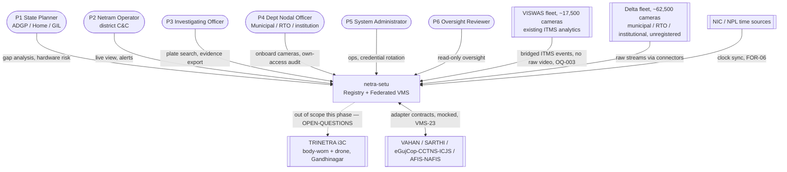
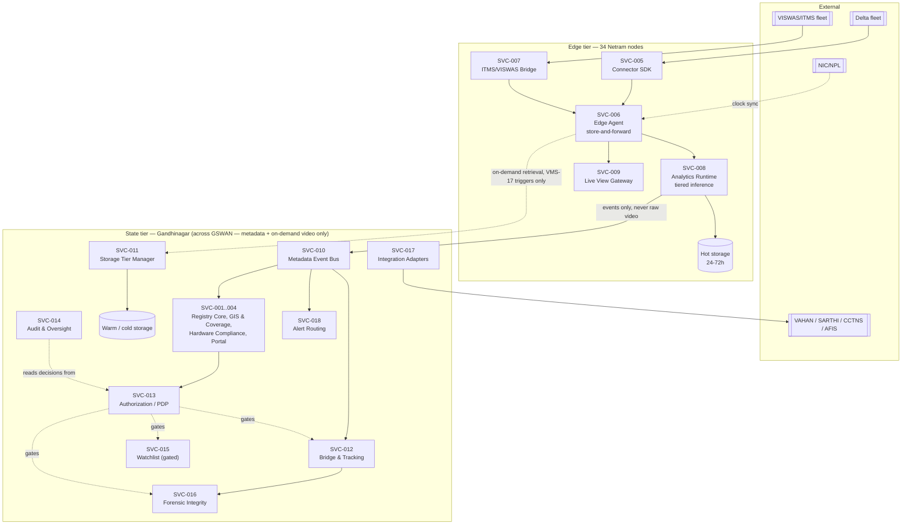
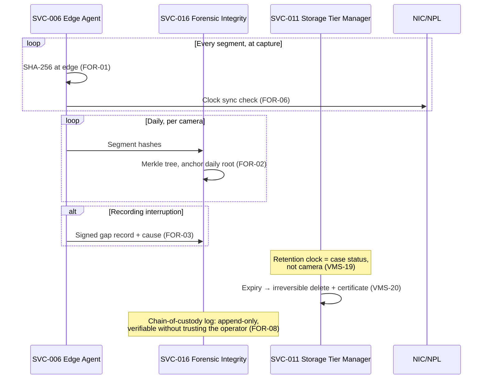

# High-level design

**Purpose.** Establish the system context, container decomposition, domain
model and end-to-end flows for netra-setu before any component-level (LLD) or
technology (ADR) decisions are made. Everything below is container-level and
technology-agnostic by design — see [§7](#7-key-decisions--pending-checkpoint)
for the load-bearing choices still open, and
[OPEN-QUESTIONS.md](OPEN-QUESTIONS.md) for everything ASSUMED here.

**Scope.** The full system: Model 1 (registry + GIS) and Model 4 (federated
VMS) as one platform, per [`SCOPE.md`](../requirements/SCOPE.md). Requirement
IDs: this document is the point every `REG-`/`VMS-`/`BRG-`/`NFR-`/`FOR-`/`SEC-`
requirement traces into at the container level; the full requirement →
container mapping is the table in [§3](#3-container-view-c4-l2). `CMP-`
requirements are referenced where they constrain a container's placement
(`CMP-08`) but are otherwise a [`COMPLIANCE.md`](../requirements/COMPLIANCE.md)
concern, not a structural one.

**Labelling.** Per [`architecture-docs.md`](../../.claude/rules/architecture-docs.md):
every non-obvious line is marked **GIVEN** (traceable to `REGISTER.md`/
`CAPACITY.md`) or **ASSUMED** (with a validation plan, or an
[OPEN-QUESTIONS.md](OPEN-QUESTIONS.md) entry). `NFR-01`–`NFR-06`'s target
*values* are GIVEN (confirmed against the private source, 2026-08-29 —
[OQ-002](OPEN-QUESTIONS.md)); the latency-budget *arithmetic* built on top of
them in [§6](#6-nfr-latency-budget-arithmetic) is ASSUMED and unvalidated
until the `CAPACITY.md` §3 load test runs.

---

## 1. Domain model and ubiquitous language

Six bounded contexts, matching the workstream split resolved in
[OQ-004](OPEN-QUESTIONS.md) (WS-1..WS-6). Each owns its entities; no entity is
written by two contexts.

| Context (≈ workstream) | Entities owned | Requirement IDs |
|---|---|---|
| Registry & GIS (WS-1) | `Camera`, `Owner`, `Site`, `HardwareRecord`, `Viewshed`, `MergeQueueEntry` | `REG-01`–`REG-19` |
| Ingestion & Streaming (WS-2) | `Connector`, `Feed`, `HealthCheck`, `EdgeBuffer` | `VMS-01`–`VMS-09`, `REG-20`–`REG-21` (per OQ-004, reassigned here) |
| Analytics (WS-3) | `AnalyticsEvent`, `ModelArtefact`, `DetectionRecord` | `VMS-10`–`VMS-15` |
| Bridge & Tracking (WS-4) | `RoadSegment`, `CutSetResult`, `CandidateSet`, `TrackingRoute` | `BRG-01`–`BRG-05`, `VMS-21`–`VMS-22` |
| Storage & Retention (WS-2, per OQ-004) | `StorageTier`, `RetentionPolicy`, `CaseLink`, `DeletionCertificate` | `VMS-16`–`VMS-20` |
| Security, Forensics & Compliance (WS-5) | `Jurisdiction`, `Purpose`, `AuthorizationRequest`, `BreakGlassGrant`, `WatchlistEntry`, `AuditEvent`, `SegmentHash`, `MerkleRoot`, `EvidenceExport`, `ChainOfCustodyEntry` | `SEC-*`, `FOR-*` |
| Integrations (WS-2, per OQ-004) | `ExternalCaseRef`, `AlertDisposition` | `VMS-23`–`VMS-24` |

`ComplianceRecord` (`REG-03`) is a projection read by the Security/Forensics
context, not owned by it — Registry remains the sole writer.

**Core vocabulary:**

- **Camera identity** — a `Camera` is addressed only by its `REG-01` URN
  (`gj:cam:<district>:<dept>:<seq>`). Every other entity below references a
  camera by URN, never by IP, vendor ID or database key.
- **Owner / custodian** — the department or institution holding legal
  authority over a `Camera` (`REG-03` `Owner`). netra-setu is never the owner;
  it is federated *over* owners (kickoff §1.2).
- **Jurisdiction** — the geographic/administrative scope an `Owner`, a
  `Camera`, or an operator's role is bound to. Every `AuthorizationRequest`
  and every `Alert` carries one (`SEC-07`, `VMS-24`).
- **Purpose** — a value from a controlled vocabulary (`SEC-08`), never free
  text, attached to any high-intrusion `AuthorizationRequest`.
- **Case** — an `ExternalCaseRef` (FIR/CCTNS number or written authorisation
  ID). The unit that video retention (`VMS-19`) and high-intrusion access
  (`SEC-08`) are keyed against — not the camera, not the requester.
- **Evidence item** — an `EvidenceExport`: the signed bundle of segments, hash
  manifest, Merkle proofs, chain-of-custody log, registry snapshot and
  analytics provenance (`FOR-04`). The only form in which video legitimately
  leaves the platform's custody.

---

## 2. System context (C4 L1)



Not modelled as an external system: "Sentinel Gujarat" — confirmed
([OQ-008](OPEN-QUESTIONS.md)) to be the challenge's own submission site, not
an integration target.

---

## 3. Container view (C4 L2)



Cross-cutting, deliberately left off the diagram to keep it legible: **SVC-019
Secrets Manager** (`SEC-05`, product choice deferred to an ADR) issues
per-camera credentials to SVC-005/006/007; **SVC-020 Time Sync** (`FOR-06`)
disciplines every container's clock, not just the Edge Agent. Both apply
platform-wide.

### Container → requirement traceability

| SVC | Container | Requirement IDs | Tier |
|---|---|---|---|
| SVC-001 | Registry Core (identity, onboarding, dedup) | `REG-01`–`REG-12` | State |
| SVC-002 | GIS & Coverage Engine (viewshed, gap/cut-set analysis) | `REG-13`–`REG-19` | State |
| SVC-003 | Hardware Compliance & Health Aggregator | `REG-20`–`REG-23` | State |
| SVC-004 | Registry Portal (web UI) | `REG-13`, `REG-19`; P1/P4/P5 screens | State |
| SVC-005 | Connector SDK / vendor adapter framework | `VMS-01`–`VMS-06` | Edge |
| SVC-006 | Edge Agent (outbound-only, store-and-forward) | `VMS-07`, `VMS-08`, `REG-20` (signal source) | Edge |
| SVC-007 | ITMS/VISWAS Bridge Connector | `OQ-003` (no requirement ID yet — see [§7](#7-key-decisions--pending-checkpoint) decision 4) | Edge |
| SVC-008 | Analytics Runtime (tiered inference) | `VMS-10`–`VMS-15` | Edge |
| SVC-009 | Live View Gateway (WebRTC/HLS) | `VMS-09` | Edge |
| SVC-010 | Metadata Event Bus / ingestion API | `VMS-16` | State |
| SVC-011 | Storage Tier Manager (hot/warm/cold) | `VMS-17`–`VMS-20` | Both (hot at edge, warm/cold central) |
| SVC-012 | Bridge & Tracking Service | `BRG-01`–`BRG-05`, `VMS-21`, `VMS-22` | State |
| SVC-013 | Authorization / Policy Decision Point | `SEC-07`–`SEC-09` | State |
| SVC-014 | Audit & Oversight Service | `SEC-11`–`SEC-15` | State |
| SVC-015 | Watchlist / Face-Match Service (gated) | `VMS-13`, `SEC-10` | State |
| SVC-016 | Forensic Integrity Service | `FOR-01`–`FOR-08` | State |
| SVC-017 | External Integration Adapters | `VMS-23` | State |
| SVC-018 | Alert Routing Service | `VMS-24` | State |
| SVC-019 | Secrets Manager | `SEC-05` | Both |
| SVC-020 | Time Sync Service | `FOR-06` | Both |

No container lacks a requirement ID. One requirement cluster lacks a
container: `SEC-06` (network segmentation / flow matrix) is infrastructure
configuration cutting across every container above, not a container itself —
tracked as a deliverable of the security architecture document (`CMP-15`),
not of this table.

---

## 4. Edge/central split and the GSWAN boundary

**Crosses GSWAN by default:** metadata events (SVC-008→SVC-010), health
signals, alerts, node-registration/config (`NFR-08`), API/portal control
traffic.

**Crosses GSWAN only on trigger:** on-demand video retrieval — one of an
alert, a case-linked request, or always-record-subset membership (`VMS-17`).
Never continuously.

**Never crosses GSWAN:** raw continuous video (`VMS-16`); this is *why* —
§2.2 of `CAPACITY.md` sizes the rejected centralised alternative at 160 Gbps
sustained / 71 PB, against an 11 Gbps metadata-plane budget (§2.5) for the
federated design actually being built.

**Partition behaviour (PACELC, stated explicitly):**

- Edge Agent (SVC-006) under partition: continues capturing, hashing
  (`FOR-01`) and buffering locally within `VMS-08`'s buffer window —
  availability over consistency with the centre. Reconciles on heal with
  capture-time timestamps preserved.
- Registry Core (SVC-001) under partition: a disconnected Netram node's
  onboarding/portal writes fail closed — consistency over availability,
  because camera identity forking (two URNs for one camera, or one URN
  double-issued) is worse than a blocked write. Reads from a local cache are
  still served (map/portal), staleness bounded by last sync.

---

## 5. End-to-end flows

### 5.1 Registry onboarding (bulk import)

```mermaid
sequenceDiagram
    actor P4 as P4 Dept Nodal Officer
    participant Portal as SVC-004 Portal
    participant Reg as SVC-001 Registry Core
    participant GIS as SVC-002 GIS &amp; Coverage
    participant Audit as SVC-014 Audit

    P4->>Portal: Upload CSV/XLSX (REG-06)
    Portal->>Reg: Validate row-by-row, dry-run preview
    Reg-->>Portal: Preview + row-level errors
    P4->>Portal: Confirm commit
    Portal->>Reg: Commit valid rows only
    Reg->>Reg: Spatial cluster + fuzzy match (REG-11) → merge queue
    Reg->>GIS: New camera → compute viewshed (REG-14)
    GIS-->>Reg: Viewshed geometry stored
    Reg->>Audit: Log onboarding event
    Reg-->>Portal: Row-level result report
```

### 5.2 Live view

```mermaid
sequenceDiagram
    actor P2 as P2 Netram Operator
    participant Portal as SVC-004 Portal
    participant LVG as SVC-009 Live View Gateway
    participant Agent as SVC-006 Edge Agent
    participant Cam as Camera

    P2->>Portal: Select camera on map
    Portal->>LVG: Request live view (VMS-09)
    LVG->>Agent: Resolve node, request session
    Agent->>Cam: Pull stream (outbound-only connector, VMS-07)
    Agent-->>LVG: WebRTC offer/answer, ICE (HLS fallback)
    LVG-->>Portal: Stream
    Note over LVG,Portal: Target: first frame &lt;2s (NFR-05) — see §6
```

### 5.3 Alerting

```mermaid
sequenceDiagram
    participant Cam as Camera
    participant Agent as SVC-006 Edge Agent
    participant AN as SVC-008 Analytics Runtime
    participant Bus as SVC-010 Metadata Event Bus
    participant Alert as SVC-018 Alert Routing
    actor P2 as P2 Netram Operator (jurisdiction-correct node)

    Cam->>Agent: Frame
    Agent->>AN: Dispatch per VMS-14 tier
    AN->>AN: Specified event (VMS-12) or ANPR hit (VMS-10)
    AN->>Bus: Publish event + provenance (VMS-15)
    Bus->>Alert: Route by jurisdiction (VMS-24)
    Alert-->>P2: Alert — target p95&lt;3s (NFR-03) — see §6
    P2->>Alert: Acknowledge / escalate / dismiss + disposition
```

### 5.4 Retrospective search — the P3 scenario, "where did this vehicle go on 14 March?"

```mermaid
sequenceDiagram
    actor P3 as P3 Investigating Officer
    participant Portal as SVC-004 Portal
    participant Bus as SVC-010 Metadata Event Bus
    participant BT as SVC-012 Bridge &amp; Tracking
    participant Authz as SVC-013 Authorization/PDP
    participant STM as SVC-011 Storage Tier Manager
    participant FOR as SVC-016 Forensic Integrity
    participant Audit as SVC-014 Audit

    P3->>Portal: Plate search, time+geo filter (VMS-21)
    Portal->>Bus: Query event store — target p95&lt;5s/90d (NFR-04)
    Bus-->>Portal: Initial hit(s)
    P3->>BT: Reconstruct route from hit
    BT->>BT: Candidate set = reachable cameras (BRG-02),<br/>constrained search (BRG-03)
    BT-->>Portal: Route + per-hop confidence (VMS-22)
    P3->>Authz: Request video retrieval — case ref, purpose, time-box (SEC-08)
    Authz-->>Audit: Log decision, allow or deny
    Authz-->>P3: Approved
    P3->>STM: Retrieve on-demand video (VMS-17)
    STM-->>FOR: Segments + hash manifest + Merkle proofs (FOR-01/02)
    FOR->>FOR: Assemble package — registry snapshot,<br/>analytics provenance (FOR-04)
    FOR-->>P3: Signed export + BSA 2023 s.63 certificate (FOR-05, ⚠ unverified)
    FOR->>Audit: Log export
```

No gap: every container in §3's table is touched by this scenario except
SVC-002 (GIS), SVC-003 (hardware compliance), SVC-015 (watchlist), SVC-017
(external integrations) and SVC-019/020 (secrets/time, cross-cutting) — all
five are legitimately outside a plate-search-driven investigation.

### 5.5 Evidence integrity pipeline (continuous chain of custody)



---

## 6. NFR latency-budget arithmetic

Targets are GIVEN ([OQ-002](OPEN-QUESTIONS.md)); the hop breakdown below is
ASSUMED and needs the `CAPACITY.md` §3 load test to confirm, especially at the
p95 tail under tiered-GPU contention — a sum of typical-case hops is not the
same claim as a validated p95.

**NFR-03 — capture → alert, p95 < 3,000 ms:**

| Hop | ASSUMED ms | Note |
|---|---|---|
| Frame capture → Analytics Runtime ingest | 50–100 | Edge-local |
| Inference (tiered; full-rate ~20 streams/GPU, TensorRT INT8) | 150–300 | No per-frame figure in `CAPACITY.md` — only streams/GPU |
| Event publish, edge → state (GSWAN) | 20–80 | GSWAN inter-node latency not stated anywhere in this repo |
| Alert Routing dispatch | 50–100 | |
| Operator console render | 50–100 | |
| **Sum (typical)** | **320–680** | Comfortable margin to 3,000ms — *if* the tail behaves like the typical case, which is exactly what's unvalidated |

**NFR-05 — live-view request → first frame, < 2,000 ms:**

| Hop | ASSUMED ms | Note |
|---|---|---|
| Portal → Live View Gateway | 50 | |
| Gateway → Edge Agent signalling | 50–100 | |
| WebRTC ICE/DTLS + first keyframe | 300–800 | Dominant cost |
| **Sum (WebRTC path)** | **400–950** | Fits under 2,000ms |
| **HLS fallback path** | **often 2,000–10,000+** | Segment-duration-bound, not signalling-bound |

**Finding:** the HLS fallback path is structurally in tension with a
sub-2-second target — typical HLS segment sizes alone can exceed the whole
budget. Either NFR-05 is read as applying to the WebRTC path only (HLS is
explicitly a fallback, and degraded-but-slower is arguably the correct
behaviour under NFR-07's degradation ladder), or low-latency HLS (LL-HLS,
sub-second segments) is required. Not resolved here — flag for decision 4/5
context or a new `OPEN-QUESTIONS.md` entry once `VMS-09`'s LLD is drafted.

---

## 7. Design principles — applied, or rejected and why

| Principle | Where applied / where rejected |
|---|---|
| Separation of concerns | Registry (SVC-001–004), VMS (SVC-005–012), Security/Forensics (SVC-013–016) communicate only via the Metadata Event Bus and defined APIs — never shared tables. |
| High cohesion / loose coupling | Each SVC owns one requirement cluster (§3 table); no SVC spans two bounded contexts. |
| SOLID at module boundaries | Deferred to LLD — this document fixes container boundaries, not internals. |
| Ports & adapters (hexagonal) | Load-bearing at SVC-005: vendor protocol is a driven adapter behind one port; the same port accepts a simulated-fleet driver (decision 9) and the ITMS bridge (SVC-007) as alternate adapters, not a parallel mock stack. |
| Anti-corruption layer | SVC-007 and SVC-017 both translate an external system's model into netra-setu's ubiquitous language; neither external schema leaks past its adapter. |
| DDD bounded contexts | §1 — six contexts matching WS-1..WS-6. |
| Dependency inversion at I/O edges | SVC-008 depends on an abstract camera-stream port, not a concrete connector — required by decision 9. |
| 12-factor config | Per-Netram-node config (jurisdiction, tier assignment) externalised, not baked into SVC-006/008 images — required by `NFR-08`. |
| Explicit state ownership | Registry Core is sole writer of camera identity; Edge Agent is sole writer of health signals. No dual-write path anywhere in §3. |
| Idempotency | Event Bus consumers keyed by (camera URN, capture timestamp, event type) — `VMS-08`'s "exactly once after reconnect" requires this. |
| At-least-once vs exactly-once | Edge→state event delivery: at-least-once + idempotent consumers, not exactly-once transport — simpler, survives reconnect per `VMS-08`. |
| Backpressure / load shedding | The event-triggered tier (`VMS-14`, largest population) is itself the load-shedding valve — it only fires on trigger. |
| Circuit breakers / timeouts | Every Edge→State call — GSWAN is explicitly constrained and lossy (kickoff §2). |
| Graceful degradation | `NFR-07`'s 30%-loss ladder is structural: every unavailable feed is attributed (camera/network/platform fault), never a blank tile. |
| CAP/PACELC per store | §4 above — stated per container, not left implicit. |
| Clock sync / event ordering | `FOR-06` — evidentiary before correctness; see flow 5.5. |
| Cache strategy | Registry read replicas at Netram nodes for map/portal reads under partition; invalidated on reconnect sync. Detail deferred to LLD. |
| YAGNI vs Model-4 seams | Registry ships without VMS running; every VMS-facing seam in it (URN scheme, provenance model) is justified by a concrete Model 4 requirement already in the register, not speculative. |

**Self-flagged over-engineering:** 20 containers is a lot for a hackathon
build. SVC-002/SVC-003 could fold into SVC-001 if the team building this is
small — kept separate here because GIS geometry and hardware-compliance state
are genuinely different data shapes with different natural owners in a real
deployment, not because the platform needs the separation to function.
Revisit once team size is known (deferred question, see the plan checkpoint).

---

## 8. Key decisions — resolved 2026-08-29

All nine load-bearing decisions from the kickoff prompt §6 were presented
with full options, trade-offs, reversibility cost and one-way/two-way-door
calls at the 2026-08-29 checkpoint; the user accepted every recommendation.
Each is now a full ADR.

| # | Decision | Chosen | ADR |
|---|---|---|---|
| 1 | Registry as system of record vs. projection | Split ownership by field type — SoR for identity/coverage/confidence, owner is upstream source for declared facts | [0001](adr/0001-registry-system-of-record-vs-projection.md) |
| 2 | Camera identity & entity resolution | Sync exact-match check + async `REG-11` batch DBSCAN/fuzzy dedup | [0002](adr/0002-camera-identity-entity-resolution.md) |
| 3 | Viewshed representation | 2D wedge polygon, footprint subtraction where available | [0003](adr/0003-viewshed-representation.md) |
| 4 | Vendor connector port | Capability-negotiated port (`stream`/`device-metadata`/`analytics-events`/`ptz-control`/`health`) | [0004](adr/0004-vendor-connector-port.md) |
| 5 | Edge/central split | All inference at the edge (Netram nodes) | [0005](adr/0005-edge-central-split.md) |
| 6 | Purpose-bound authorisation | Centralised PDP (SVC-013), fail-closed cache as documented upgrade path | [0006](adr/0006-purpose-bound-authorisation.md) |
| 7 | Evidence chain of custody | Transparency log **and** RFC 3161 timestamp, both | [0007](adr/0007-evidence-chain-of-custody.md) |
| 8 | Camera trust bootstrap | Tiered trust reusing `REG-04`'s provenance/confidence model | [0008](adr/0008-camera-trust-bootstrap.md) |
| 9 | Simulated-fleet architecture | Synthetic driver behind the real connector port, real URNs, new `synthetic` flag | [0009](adr/0009-simulated-fleet-architecture.md) |

Two schema/requirement proposals surfaced while writing the ADRs, not
invented unilaterally per `.claude/rules/requirements.md`:
[OQ-006](OPEN-QUESTIONS.md) (no ID for the "real personal data" exclusion) and
[OQ-010](OPEN-QUESTIONS.md) (no field distinguishes a synthetic camera from a
real one, from ADR 0009) — both need the user's sign-off before any ID or
field is created.

---

## What this does not cover

- LLD-level component decomposition, sequence diagrams with error/retry
  paths, state machines, error taxonomy, concurrency model, idempotency keys
  — one file per workstream, `docs/architecture/lld/`, next phase
  ([OQ-004](OPEN-QUESTIONS.md)).
- Component-level implementation of any of the nine ADRs' decisions — LLD
  work, not this document or the ADRs themselves. The two pending schema
  sign-offs the ADRs surfaced ([OQ-006](OPEN-QUESTIONS.md),
  [OQ-010](OPEN-QUESTIONS.md)) are not yet created.
- `CAPACITY.md` extensions (multi-point scaling curve at 1/100/7,000/17,500/
  80,000 cameras, Netram-node resource envelope, cost sketch) and the
  VISWAS/tier reconciliation flagged in [OQ-009](OPEN-QUESTIONS.md).
- `COMPLIANCE.md` refinements and `SCOPE.md`'s roadmap/milestones section.
- Detailed API contracts: `REG-08`'s OpenAPI spec, the SVC-005 connector port
  interface signature.
- Container *internals* for anything the nine pending decisions would change
  — this document's containers are deliberately technology-agnostic; expect
  SVC-001, SVC-002, SVC-005, SVC-007 and SVC-013 to gain implementation detail
  once those ADRs land, not to change shape.
- Anything already listed as unresolved in [OPEN-QUESTIONS.md](OPEN-QUESTIONS.md)
  — most notably [OQ-001](OPEN-QUESTIONS.md) (register provenance beyond the
  PDF's §1–4) and [OQ-009](OPEN-QUESTIONS.md) (VISWAS/tier overlap).
