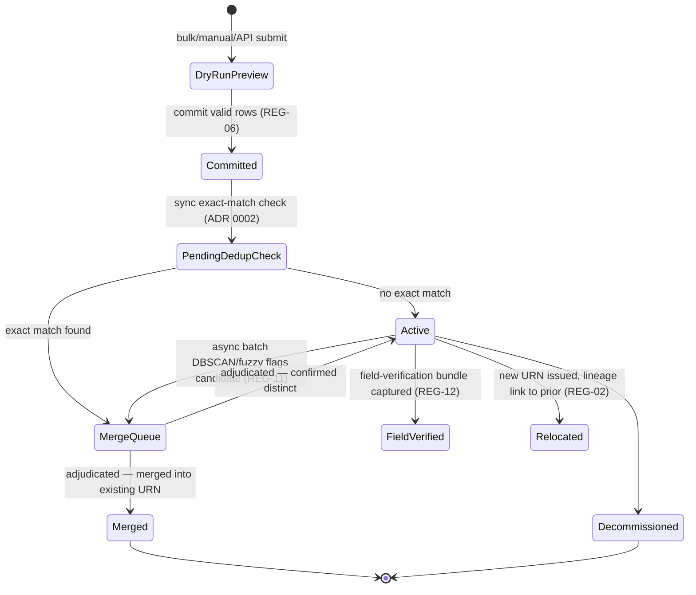
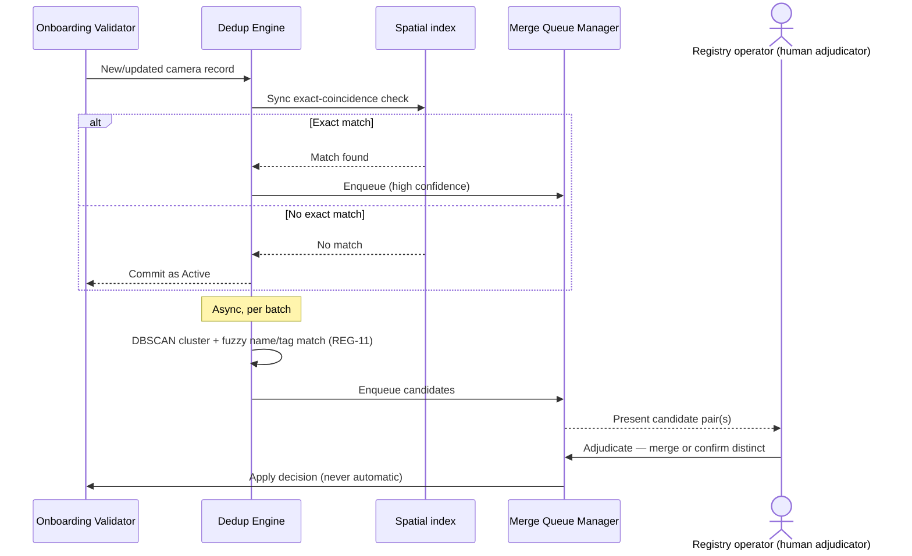
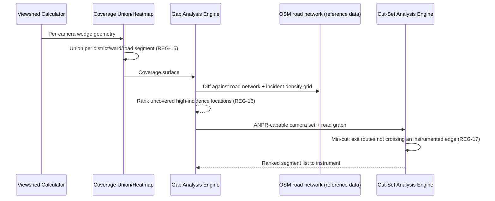

# WS-1 — Registry & GIS

**Purpose.** Component-level design for camera identity, onboarding,
deduplication, viewshed/coverage computation, gap and cut-set analysis, and
hardware/health posture reporting.

**Scope.** Requirement IDs: `REG-01`–`REG-23` (all, per `SCOPE.md` §3's
2026-08-29 resolution). Containers: SVC-001 (Registry Core), SVC-002 (GIS &
Coverage Engine), SVC-003 (Hardware Compliance & Health Aggregator), SVC-004
(Registry Portal) — see [`HLD.md`](../HLD.md) §3. Realises
[ADR 0001](../adr/0001-registry-system-of-record-vs-projection.md),
[0002](../adr/0002-camera-identity-entity-resolution.md) and
[0003](../adr/0003-viewshed-representation.md).

---

## 1. Component decomposition

| Component | Container | Responsibility | Requirement IDs |
|---|---|---|---|
| Onboarding Validator | SVC-001 | Row/field validation, schema mapping, dry-run preview | `REG-06`, `REG-07`, `REG-08` |
| URN Issuer | SVC-001 | Issues `gj:cam:<district>:<dept>:<seq>`; lineage link on relocation | `REG-01`, `REG-02` |
| Provenance/Confidence Tracker | SVC-001 | Per-field `declared`/`probed`/`field-verified` + score | `REG-04` |
| Coordinate Plausibility Checker | SVC-001 | Flags implausible coordinate/jurisdiction combinations | `REG-10` |
| Dedup Engine | SVC-001 | Sync exact-match check + async DBSCAN/fuzzy batch (ADR 0002) | `REG-11` |
| Merge Queue Manager | SVC-001 | Human-adjudication workflow over dedup candidates | `REG-11` |
| ONVIF Discovery Probe | SVC-001 | Subnet probe, populates make/model/firmware/profiles | `REG-09` |
| Field-Verification Intake | SVC-001 | GPS/azimuth/height capture bundle, provenance upgrade | `REG-12` |
| Viewshed Calculator | SVC-002 | 2D wedge polygon + footprint subtraction (ADR 0003) | `REG-14` |
| Coverage Union/Heatmap Renderer | SVC-002 | Per-district/ward/road-segment union, heatmap tiles | `REG-15` |
| Gap Analysis Engine | SVC-002 | Coverage vs. OSM road network vs. incident density | `REG-16` |
| Cut-Set Analysis Engine | SVC-002 | Road graph min-cut over ANPR-instrumented edges | `REG-17` |
| Map/Filter/Export Service | SVC-004 | Layered map, search/filter, CSV/GeoJSON export | `REG-13`, `REG-19` |
| Health Aggregator | SVC-003 | Aggregates WS-2 Edge Agent health signals per camera | `REG-20` |
| Maintenance Workflow Engine | SVC-003 | SLA clock, MTTR reporting | `REG-21` |
| Hardware Compliance Reporter | SVC-003 | Certification/EOL/credential-rotation/vendor-support fields | `REG-22` |
| Hardware Risk Ranker | SVC-003 | Fleet ranking by exposure, district/department rollups | `REG-23` |

## 2. State machines

**Camera lifecycle** (SVC-001):

**MaintenanceTicket** (SVC-003, `REG-21`): `Open → InProgress → Resolved`
(SLA clock running throughout) or `Open → InProgress → Breached` (SLA
exceeded, still reportable — MTTR includes breached tickets, not just met
ones).

## 3. Sequence diagrams

### 3.1 Dedup and merge adjudication (detail beneath `HLD.md` §5.1)

### 3.2 Gap analysis pipeline

## 4. Error taxonomy

| Error | Handling |
|---|---|
| Row fails schema validation (`REG-06`) | Rejected with per-row reason; valid rows still commit |
| Coordinate implausible for stated jurisdiction (`REG-10`) | Flagged, not rejected — held for human review |
| Viewshed missing azimuth/height/FOV | **ASSUMED unresolved** — `REG-14`'s own gap; interim: camera onboards without a viewshed, flagged incomplete on the map, excluded from coverage union until supplied. Validation plan: confirm with a small onboarding batch before Stage 2. |
| ONVIF discovery timeout/auth failure | Logged per-device, probe continues across subnet |
| Merge Queue: adjudicator merges into a URN that was itself since relocated | Reject the merge, surface the lineage chain, require re-adjudication |
| Hardware Compliance: certification-status source unavailable (`SCOPE.md` Q-05) | Field recorded `provenance: declared`, confidence low, never blocks onboarding |

## 5. Concurrency model

- **URN sequence counter** (`<seq>` in `gj:cam:<district>:<dept>:<seq>`): a
  per-(district, dept) monotonic counter — contention scoped to one
  district+department pair, not global. A database sequence or equivalent
  single-writer counter per pair is sufficient; no cross-pair coordination
  needed.
- **Bulk import**: rows within one batch validate and commit in parallel;
  the sync dedup check (§3.1) serialises only on spatial-index writes
  local to nearby coordinates, not the whole batch.
- **Concurrent field-verification vs. bulk update** to the same camera:
  field-verification (higher provenance) wins — a concurrent lower-provenance
  write does not downgrade a `field-verified` record (per `REG-04` and
  [ADR 0001](../adr/0001-registry-system-of-record-vs-projection.md)'s
  reconciliation stance).

## 6. Idempotency keys

| Operation | Key |
|---|---|
| Bulk import row commit | (batch ID, row number) — resubmitting the same batch does not duplicate |
| ONVIF discovery scan | (subnet, scan ID) |
| Merge adjudication | (candidate pair ID) — re-adjudicating an already-resolved pair is a no-op, logged |
| Viewshed recomputation | (camera URN, input hash of position/height/azimuth/FOV) — unchanged inputs skip recompute |

## What this does not cover

- The specific spatial-store product for the 2D wedge geometry — deferred
  by [ADR 0003](../adr/0003-viewshed-representation.md) to a separate,
  smaller decision.
- The exact plausibility-tolerance threshold for `REG-10` — not stated in
  the baseline, needs defining before this LLD is implementation-ready.
- `REG-20`'s raw signal collection — that's WS-2's Edge Agent; this LLD
  covers only the aggregation/presentation side.
