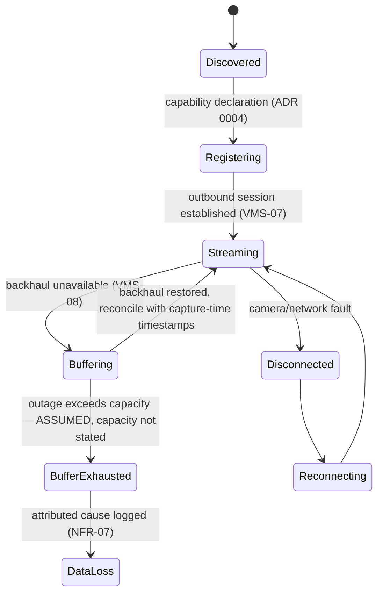
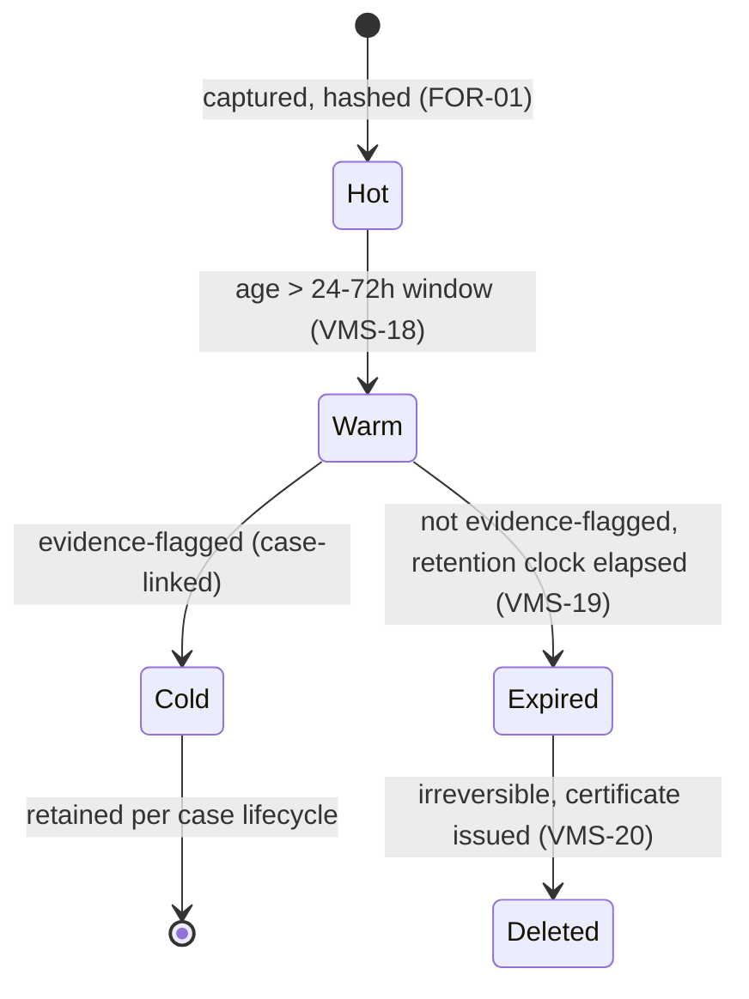
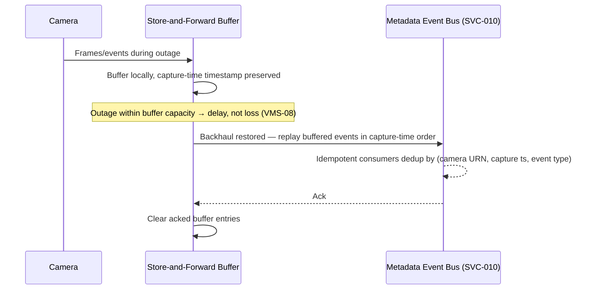
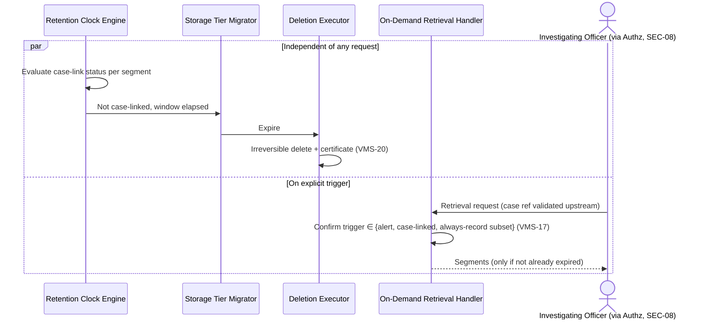

# WS-2 — Ingestion & Streaming

**Purpose.** Component-level design for vendor connectivity, edge
store-and-forward, live view delivery, and tiered storage/retention.

**Scope.** Requirement IDs: `VMS-01`–`VMS-09`, `VMS-16`–`VMS-20` (per
`SCOPE.md` §3's 2026-08-29 resolution). Containers: SVC-005 (Connector SDK),
SVC-006 (Edge Agent), SVC-007 (ITMS/VISWAS Bridge), SVC-009 (Live View
Gateway), SVC-011 (Storage Tier Manager) — see [`HLD.md`](../HLD.md) §3.
Realises [ADR 0004](../adr/0004-vendor-connector-port.md) and
[0005](../adr/0005-edge-central-split.md).

---

## 1. Component decomposition

| Component | Container | Responsibility | Requirement IDs |
|---|---|---|---|
| Connector Registry | SVC-005 | Capability declaration/negotiation (ADR 0004) | `VMS-01` |
| ONVIF Adapter (Profiles S/G/T/M) | SVC-005 | Streaming, recording/replay, analytics metadata | `VMS-02` |
| RTSP/RTP/RTCP Adapter | SVC-005 | Raw stream, common auth variants | `VMS-03` |
| Vendor API Adapters (Hikvision/Axis/Dahua) | SVC-005 | ISAPI/VAPIX/vendor API | `VMS-04` |
| GB/T 28181 Adapter (stub) | SVC-005 | Interface defined, deferred (`Build: MODEL`) | `VMS-05` |
| Analog/DVR Adapter (stub) | SVC-005 | DVR/NVR-level integration (`Build: MODEL`) | `VMS-06` |
| ITMS/VISWAS Bridge | SVC-007 | `analytics-events` + `device-metadata` capability only | `OQ-003` |
| Simulated-Fleet Driver | SVC-005 | FFmpeg-looped files, real capability set (ADR 0009) | build-class discipline |
| Store-and-Forward Buffer | SVC-006 | Local buffering across backhaul outage | `VMS-07`, `VMS-08` |
| Health Signal Emitter | SVC-006 | Reachability/integrity/frame-rate/focus/scene-change/tamper | `REG-20` (source) |
| Metadata Event Bus | SVC-010 | Partitioned log; transports structured events to the state tier, never raw video | `VMS-16` |
| WebRTC/HLS Session Manager | SVC-009 | Live view delivery, fallback | `VMS-09` |
| Hot Storage Manager | SVC-006 | 24–72h edge-local retention | `VMS-18` |
| Storage Tier Migrator | SVC-011 | Hot → warm promotion/eviction | `VMS-18` |
| Retention Clock Engine | SVC-011 | Clock keyed by case status, not camera | `VMS-19` |
| On-Demand Retrieval Handler | SVC-011 | Validates one of the 3 `VMS-17` triggers before pulling from hot/warm | `VMS-17` |
| Deletion Executor | SVC-011 | Irreversible delete + certificate | `VMS-20` |

## 2. State machines

**Connector/Feed:**

**StorageTier residency** (per segment):

## 3. Sequence diagrams

### 3.1 Store-and-forward reconciliation on reconnect

### 3.2 Retention expiry vs. case-linked retrieval

## 4. Error taxonomy

| Error | Handling |
|---|---|
| Connector auth failure | Retry with backoff; surfaced on P5's connector-status dashboard |
| Stream decode failure | Feed marked degraded, attributed cause shown (`NFR-07`) — never a blank tile |
| Buffer exhausted before backhaul restored | Data loss boundary — **ASSUMED**, `CAPACITY.md` doesn't state buffer-hours; needs sizing before this is implementation-ready ([`OPEN-QUESTIONS.md`](../OPEN-QUESTIONS.md), `CAPACITY.md` §7) |
| WebRTC negotiation failure | Falls back to HLS — see `HLD.md` §6's finding: HLS may itself miss `NFR-05`'s 2s target |
| Storage tier migration failure (hot→warm) | Retried; segment stays in hot tier past its normal window rather than being lost — hot-tier capacity pressure is the consequence, tracked on the ops dashboard |
| Retention deletion failure | Must not silently fail — `VMS-20` requires a certificate per deletion; a failed deletion blocks certificate issuance and alerts P5 |
| On-demand retrieval requested with no valid trigger | Refused, logged (this is `SEC-08`'s gate, enforced upstream by WS-5's PDP — this component trusts the PDP's decision, does not re-implement policy) |

## 5. Concurrency model

- Each Netram node runs many connectors concurrently (up to ~2,300+ cameras
  per node at 80,000/34 — **ASSUMED** even distribution; real distribution
  will be uneven by district size). Connector processes are independent;
  one camera's failure does not affect another's.
- Event publish to the Metadata Event Bus is **at-least-once**, not
  exactly-once (per `HLD.md` §7) — consumers must be idempotent, not the
  transport.
- Storage tier migration and retention-clock evaluation run as independent
  background sweeps, not synchronised with each other — a segment can be
  mid-migration when its retention clock elapses; the deletion executor
  checks current tier before acting, not a stale reference.

## 6. Idempotency keys

| Operation | Key |
|---|---|
| Event publish (edge → bus) | (camera URN, capture timestamp, event type) |
| Buffered-segment replay on reconnect | (camera URN, segment sequence number) |
| Storage tier migration | (segment hash, target tier) — re-running a migration already applied is a no-op |
| Deletion | (segment hash) — a second deletion attempt against an already-deleted segment returns the existing certificate, does not re-delete |

## What this does not cover

- Buffer capacity sizing in hours (`VMS-08`) — open in `CAPACITY.md` §7,
  not resolved here.
- The Metadata Event Bus's specific transport product (partitioned-log
  technology choice) — a smaller, separate ADR at implementation time; this
  LLD fixes only that it is partitioned and events-only.
- Hot/warm tier storage volumes are now derived in `CAPACITY.md` §6.2 —
  not duplicated here.
- The Analytics Runtime's internal tiering logic (`VMS-14`) — WS-3's LLD.
- GB/T 28181 and analog/DVR adapter implementation — `Build: MODEL`,
  interface only, per `SCOPE.md`.
