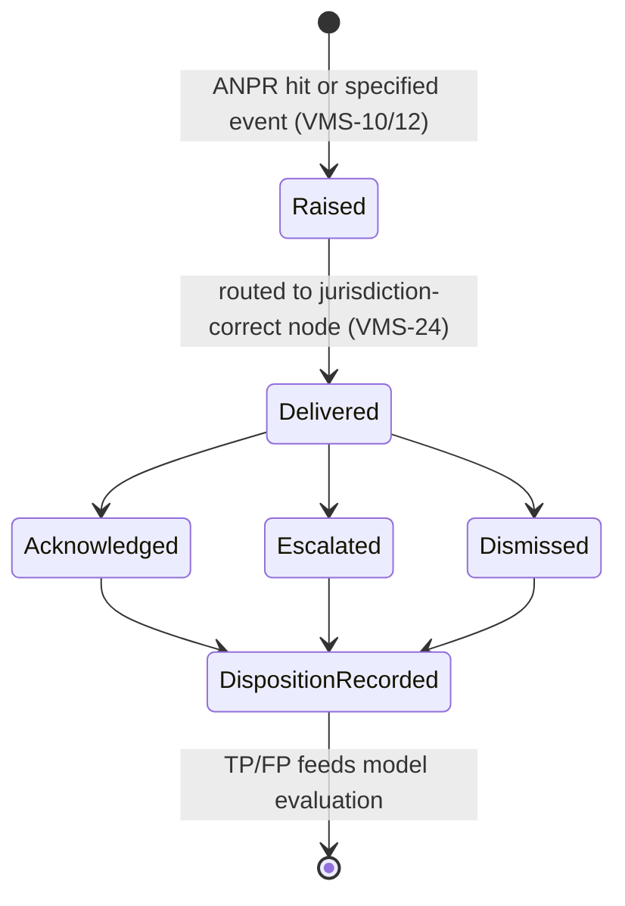
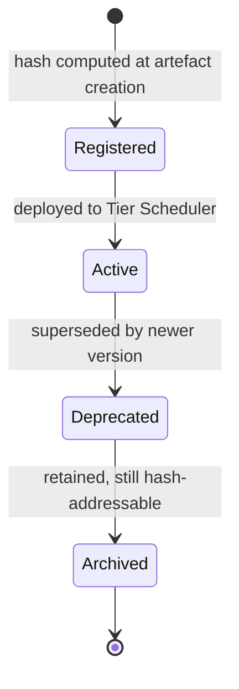
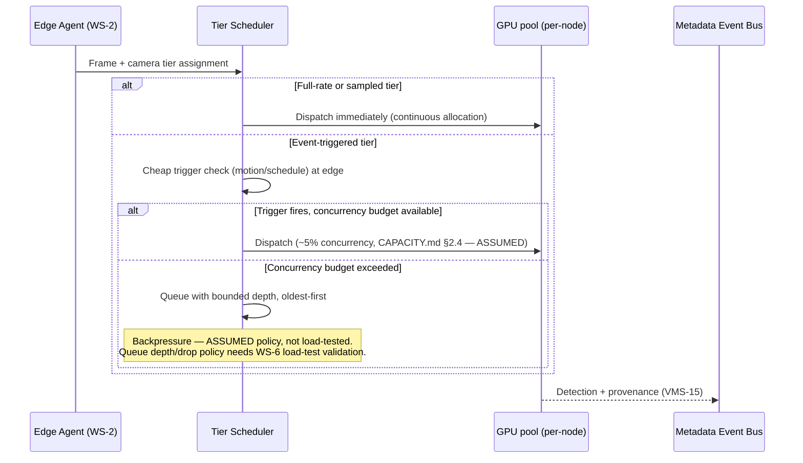
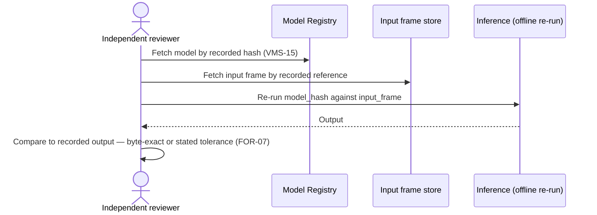

# WS-3 — Analytics

**Purpose.** Component-level design for tiered inference, ANPR, vehicle
attributes, specified-event detection, provenance recording, model cards,
and alert routing/disposition.

**Scope.** Requirement IDs: `VMS-10`–`VMS-15`, `VMS-24`, `CMP-16` (per
`SCOPE.md` §3's 2026-08-29 resolution). Container: SVC-008 (Analytics
Runtime), SVC-018 (Alert Routing) — see [`HLD.md`](../HLD.md) §3. Consumes
[ADR 0004](../adr/0004-vendor-connector-port.md)'s `analytics-events`
capability (for bridged VISWAS input) and produces input to WS-5's Watchlist
gating (`SEC-10`) for `VMS-13`.

---

## 1. Component decomposition

| Component | Responsibility | Requirement IDs |
|---|---|---|
| Tier Scheduler | Assigns/enforces per-camera inference tier (full-rate/sampled/event-triggered) | `VMS-14` |
| ANPR Pipeline | Plate detection + OCR, per-condition accuracy measurement | `VMS-10` |
| Vehicle Attribute Extractor | Class/colour/coarse-make, Indian road-class taxonomy | `VMS-11` |
| Specified-Event Detector | Unattended object, crowd density, wrong-way, loitering, tamper — enumerated only | `VMS-12` |
| Face-Match Pipeline | Runs only against a `SEC-10`-gated watchlist (WS-5 enforces the gate; this component calls it) | `VMS-13` |
| Provenance Recorder | Model name/version/artefact hash/input-frame ref/confidence per output | `VMS-15` |
| Model Registry | Hash-addressable model artefacts, for `FOR-07` reproducibility | `VMS-15`, `FOR-07` |
| Alert Formatter | Emits alert with jurisdiction tag | `VMS-24` |
| Disposition Tracker | Captures TP/FP disposition, feeds evaluation | `VMS-24` |
| Model Evaluation Feedback Loop | Disposition data → threshold tuning input (`R-07`) | `VMS-24` |

## 2. State machines

**Alert lifecycle:**

**ModelArtefact lifecycle** (`VMS-15`, `FOR-07`):

Note: `Archived` is a terminal-but-retrievable state, not deletion — `FOR-07`
requires the exact model version to remain re-runnable against a recorded
input, indefinitely (or at least for the evidence-retention lifetime of any
detection it produced).

## 3. Sequence diagrams

### 3.1 Tiered dispatch under event-triggered burst (backpressure)

### 3.2 `FOR-07` reproducibility check

## 4. Error taxonomy

| Error | Handling |
|---|---|
| GPU OOM / inference timeout under contention | Event-triggered tier sheds load first (lowest priority); full-rate tier is never shed — ASSUMED priority ordering, needs stating as a real SLA, not just a default |
| False-positive flood (`R-07`) | Disposition tracker feeds tuning loop; does not auto-suppress without a human-confirmed pattern — auto-suppression would risk masking a real pattern |
| Model version mismatch at `FOR-07` reproduction time | Reproduction fails explicitly (model not found in registry) rather than silently substituting a newer version |
| Camera assigned wrong tier (config drift) | Reported on P5's ops dashboard; `VMS-14`'s acceptance criterion ("running rate matches assigned tier") is the check |
| Watchlist call from Face-Match Pipeline against an expired/over-cap entry | Refused by WS-5's gate — this component never re-implements the cap/expiry check itself |

## 5. Concurrency model

- GPU scheduling is per-Netram-node, not global — a node's contention
  affects only its own cameras (matches [ADR 0005](../adr/0005-edge-central-split.md)'s
  all-inference-at-the-edge decision).
- Full-rate and sampled tiers hold a fixed, reserved allocation; the
  event-triggered tier competes for the remaining budget only — this is
  what makes the ~5% concurrency assumption (`CAPACITY.md` §2.4) load-bearing
  and in need of validation (WS-6).
- Alert deduplication: the same vehicle detected by adjacent cameras within
  a short window is not automatically merged into one alert — each alert
  stands alone with its own confidence and camera reference; route
  reconstruction (WS-4) is where multi-camera correlation actually happens.

## 6. Idempotency keys

| Operation | Key |
|---|---|
| Detection record | (model artefact hash, input frame hash) — deterministic given `FOR-07`'s reproducibility requirement |
| Alert | (camera URN, event type, capture timestamp window) — a resend within the same window doesn't duplicate |
| Disposition record | (alert ID) — one disposition per alert, later updates overwrite rather than append |

## What this does not cover

- The actual detection/OCR model architecture and training pipeline —
  outside architecture scope; `CMP-16`'s model card is the artefact this
  LLD's Provenance Recorder feeds.
- The event-triggered tier's queue depth and drop policy — flagged ASSUMED
  above, needs the WS-6 load test.
- Watchlist gallery cap/expiry enforcement itself — WS-5's LLD.
