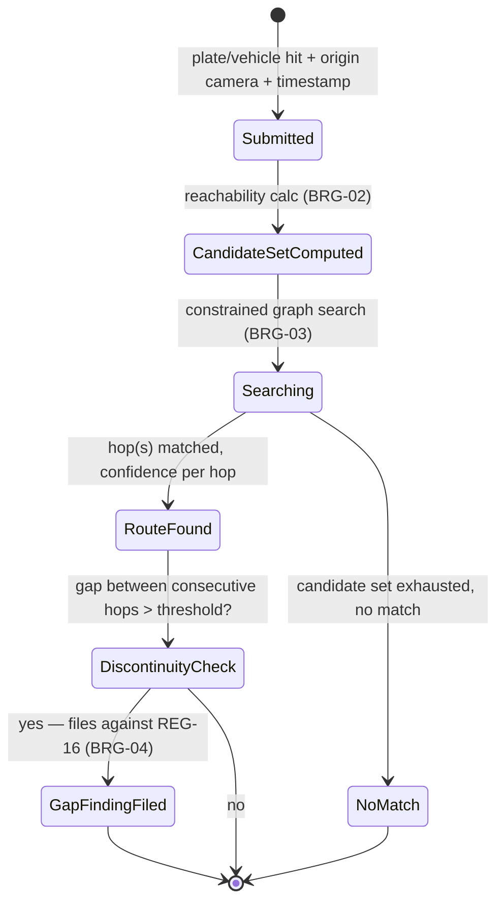
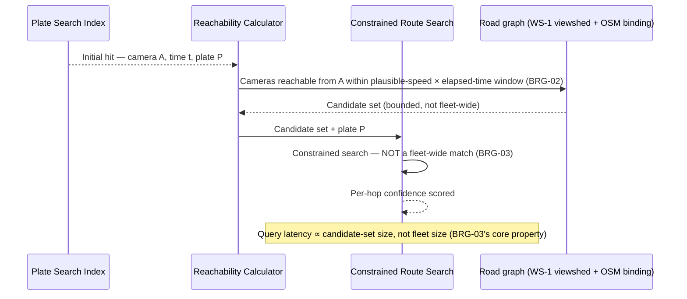
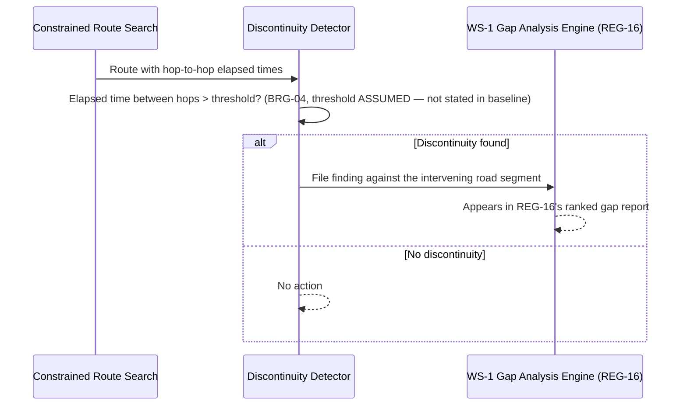

# WS-4 — Bridge & Tracking

**Purpose.** Component-level design for binding cameras to the road graph,
geometry-constrained candidate generation, route reconstruction, and the
reverse gap-analysis feedback loop.

**Scope.** Requirement IDs: `BRG-01`–`BRG-05`, `VMS-21`, `VMS-22`. Container:
SVC-012 (Bridge & Tracking Service) — see [`HLD.md`](../HLD.md) §3. Consumes
WS-1's road-graph/viewshed data and feeds WS-1's gap report (`REG-16`) back —
the one workstream whose LLD is substantially about a feedback loop into
another.

---

## 1. Component decomposition

| Component | Responsibility | Requirement IDs |
|---|---|---|
| Road Segment Binder | Binds camera to OSM edge + direction of view | `BRG-01` |
| Reachability Calculator | Travel-time-window candidate set from an ANPR hit | `BRG-02` |
| Constrained Route Search | Graph search over the candidate set only, not fleet-wide | `BRG-03` |
| Discontinuity Detector | Flags tracking gaps exceeding a threshold | `BRG-04` |
| Viewshed-Derived Config | Zone/direction/plate-size-in-pixels auto-configuration from geometry | `BRG-05` |
| Plate Search Index | Time+geography-filtered event search | `VMS-21` |
| Route Renderer | Map rendering with per-hop confidence | `VMS-22` |

## 2. State machines

**TrackingQuery:**

## 3. Sequence diagrams

### 3.1 Candidate-set-constrained route reconstruction (detail beneath `HLD.md` §5.4)

### 3.2 Discontinuity → gap-report feedback

## 4. Error taxonomy

| Error | Handling |
|---|---|
| Camera has no `BRG-01` binding | Reported as unbound, not silently excluded (`BRG-01`'s own acceptance criterion) |
| Candidate set is empty (no cameras reachable in window) | Reported as "no route found," distinct from "route found, low confidence" — the two must not be conflated in the UI |
| Implausible-speed configuration produces an oversized candidate set | Bounds check against fleet size; if the candidate set approaches fleet-wide, `BRG-03`'s core property (latency ∝ candidates) is violated — flagged as a config error, not silently accepted |
| Discontinuity threshold not configured | **ASSUMED gap** — `BRG-04`'s threshold value isn't stated in the baseline; needs a default before this is implementation-ready, logged as a validation-needed ASSUMED value |

## 5. Concurrency model

- Candidate-set computation (`BRG-02`) must complete fast enough to keep
  `VMS-21`'s p95<5s search budget (`NFR-04`) intact once `BRG-03`'s
  constrained search is added on top — this LLD's search step is additive
  latency on top of the plate-search index lookup, not a replacement for
  it; the two run in sequence, not parallel, for a single query.
- Multiple concurrent `TrackingQuery`s (different investigators, different
  vehicles) are fully independent — no shared mutable state between them.

## 6. Idempotency keys

| Operation | Key |
|---|---|
| TrackingQuery | (origin camera URN, origin timestamp, plate/vehicle ID) — a resubmitted identical query returns the cached candidate set/route within a TTL rather than recomputing |
| Gap-finding filing (`BRG-04`) | (road segment ID, discontinuity window) — repeated discontinuities on the same segment increment a count rather than filing duplicate findings |

## What this does not cover

- The discontinuity threshold's actual value — `ASSUMED`, needs a stated
  validation plan or an [`OPEN-QUESTIONS.md`](../OPEN-QUESTIONS.md) entry
  before implementation.
- `VAHAN`/`SARTHI` enrichment of a tracked vehicle's registration/licence
  details — that's WS-5's `VMS-23` adapters, called from the investigation
  UI, not from this service.
