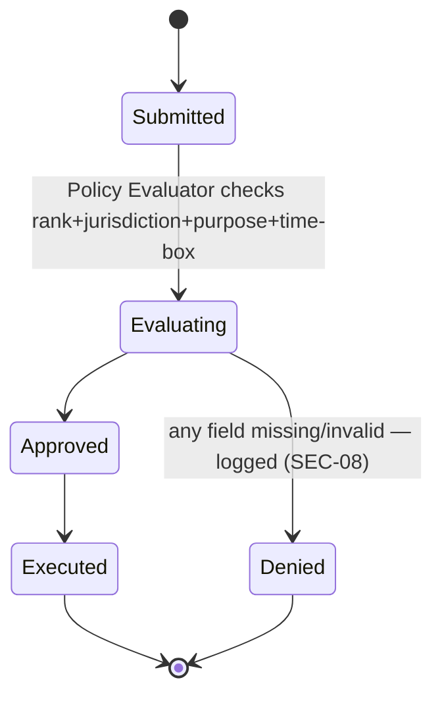
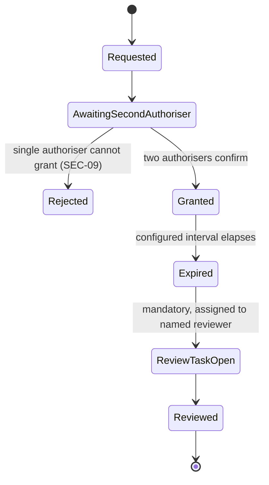
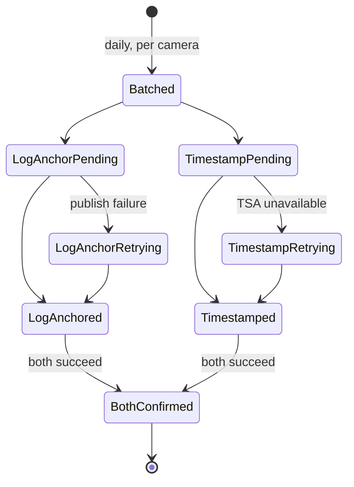
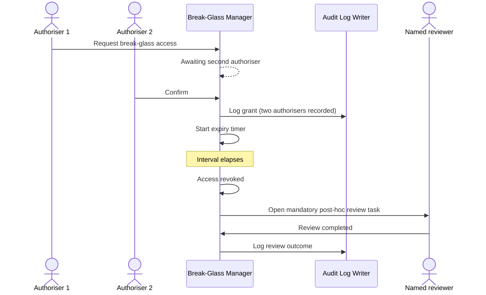
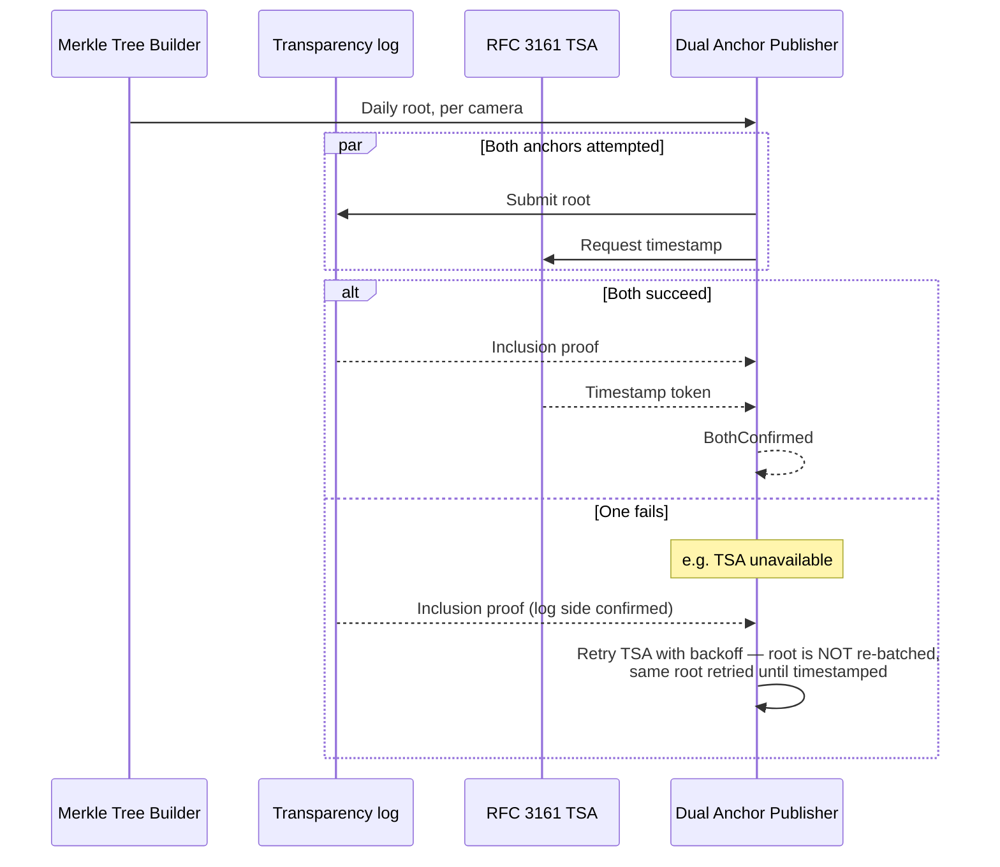

# WS-5 — Security, Forensics & Compliance

**Purpose.** Component-level design for purpose-bound authorisation,
break-glass, audit/oversight, watchlist gating, forensic chain of custody,
and external system integration adapters.

**Scope.** Requirement IDs: `SEC-01`–`SEC-17`, `FOR-01`–`FOR-08`,
`CMP-01`–`CMP-15`, `VMS-23` (per `SCOPE.md` §3's 2026-08-29 resolution).
Containers: SVC-013 (Authorization/PDP), SVC-014 (Audit & Oversight), SVC-015
(Watchlist), SVC-016 (Forensic Integrity), SVC-017 (Integration Adapters),
SVC-019 (Secrets Manager), SVC-020 (Time Sync) — see [`HLD.md`](../HLD.md)
§3. Realises [ADR 0006](../adr/0006-purpose-bound-authorisation.md),
[0007](../adr/0007-evidence-chain-of-custody.md) and
[0008](../adr/0008-camera-trust-bootstrap.md).

---

## 1. Component decomposition

| Component | Container | Responsibility | Requirement IDs |
|---|---|---|---|
| Policy Evaluator | SVC-013 | Joint rank+jurisdiction+purpose+time-box decision (ADR 0006) | `SEC-07`, `SEC-08` |
| Break-Glass Manager | SVC-013 | Two-authoriser grant, expiry, mandatory review task | `SEC-09` |
| Rate Limiter / Anomaly Detector | SVC-013 | Per-user/role limits; volume/off-jurisdiction/repeat-search flags | `SEC-12` |
| Honeytoken Manager | SVC-013 | Decoy records; access triggers alert | `SEC-13` |
| Audit Log Writer | SVC-014 | Append-only, independently verifiable | `SEC-11`, `FOR-08` |
| Oversight Dashboard Query Service | SVC-014 | Read-only: volumes, face-search counts, denials, anomalies | `SEC-14` |
| Owner Access Visibility Service | SVC-014 | Per-department view of access to their own cameras | `SEC-15` |
| Watchlist Gallery Manager | SVC-015 | Cap enforcement, mandatory expiry, encrypted irreversible embeddings | `SEC-10` |
| Segment Hash Verifier | SVC-016 | Confirms edge-computed `SHA-256` on ingest | `FOR-01` |
| Merkle Tree Builder | SVC-016 | Per-camera per-day tree | `FOR-02` |
| Dual Anchor Publisher | SVC-016 | Transparency log **and** RFC 3161 (ADR 0007) | `FOR-02` |
| Gap Record Handler | SVC-016 | Signed interruption record + cause | `FOR-03` |
| Evidence Package Assembler | SVC-016 | Segments, manifest, proofs, custody log, registry snapshot, provenance | `FOR-04` |
| Admissibility Certificate Generator | SVC-016 | Auto-generated BSA 2023 s.63 certificate (⚠ unverified) | `FOR-05` |
| Drift Monitor | SVC-016 + SVC-020 | Clock drift recording, flags affected exports | `FOR-06` |
| Case Reference Validator | SVC-017 | Confirms a case ref against eGujCop/CCTNS/ICJS (mocked, `Build: SIM`) | `VMS-23` |
| VAHAN/SARTHI/AFIS-NAFIS Adapters | SVC-017 | Registration/licence/biometric lookup (mocked, `Build: SIM`) | `VMS-23` |
| Trust-Tier Flag Manager | SVC-013 | Records/exposes each camera's authentication tier (ADR 0008) | `SEC-01` |

## 2. State machines

**AuthorizationRequest:**

**BreakGlassGrant:**

**MerkleAnchor** (`FOR-02`, ADR 0007 dual-anchor):

## 3. Sequence diagrams

### 3.1 Break-glass grant and mandatory review

### 3.2 Dual-anchor publish with partial failure

## 4. Error taxonomy

| Error | Handling |
|---|---|
| PDP unavailable | Fail closed (ADR 0006) — every gated operation refused, logged as "PDP unavailable," distinct from a policy-based denial |
| Single-authoriser break-glass attempt | Rejected outright — never partially granted |
| One of the two anchors (log/TSA) fails | Root retried on that anchor only; the other anchor's proof is not discarded — see §2 state machine |
| Watchlist enrolment beyond cap | Rejected outright, logged |
| Watchlist match attempted against expired entry | Refused — entry excluded from match set, not just flagged |
| `VMS-23` adapter (VAHAN/SARTHI/CCTNS/AFIS) unavailable | Case reference validation fails closed for `SEC-08`'s gate — an unreachable adapter must not be treated as "case valid" by default. All four adapters are `Build: SIM` (mocked) per `SCOPE.md`; this failure mode applies once real endpoints exist |
| Honeytoken accessed | Not an "error" functionally, but routed identically to a security alert — immediate, high-priority |

## 5. Concurrency model

- Audit log writes are append-only under concurrent writers from every
  other WS-1..WS-4 container — requires either a single-writer queue in
  front of the log or a conflict-free append primitive (e.g.
  compare-and-append per partition keyed by writer). Never a shared
  mutable "last entry" pointer editable by multiple writers directly.
- Rate-limiting counters are per-user/per-role and must be atomically
  incremented under concurrent requests from the same user — a
  check-then-increment race must not allow two concurrent requests to both
  pass a limit check that only one should have passed.
- Merkle tree construction is inherently sequential per (camera, day) — no
  concurrency concern there; different cameras'/days' trees build fully
  independently and in parallel.

## 6. Idempotency keys

| Operation | Key |
|---|---|
| Audit log entry | (event UUID) — retried writes with the same UUID do not duplicate |
| Evidence export request | (case ref, requester, time-box) — resubmission within the same time-box returns the existing export rather than re-assembling |
| Break-glass grant | (request ID) |
| Anchor publish retry | (Merkle root hash, anchor type) — retrying a failed TSA request for the same root does not re-batch or change the root |

## What this does not cover

- The specific policy-as-code engine/language for the Policy Evaluator —
  smaller, separate ADR at implementation time.
- Which transparency-log implementation/hosting to use — flagged as an
  open question in [ADR 0007](../adr/0007-evidence-chain-of-custody.md).
- The trust-tier eligibility-narrowing rule set (which operations a
  low-trust camera's feed is excluded from) — flagged in
  [ADR 0008](../adr/0008-camera-trust-bootstrap.md) as still needing
  definition; not resolved here either.
- Real VAHAN/SARTHI/eGujCop-CCTNS-ICJS/AFIS-NAFIS endpoints — `Build: SIM`,
  mocked only, per `SCOPE.md`; availability is `SCOPE.md` Q-03.
