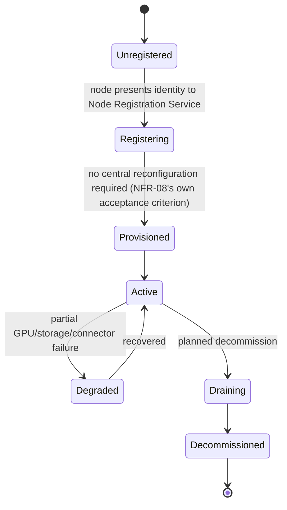
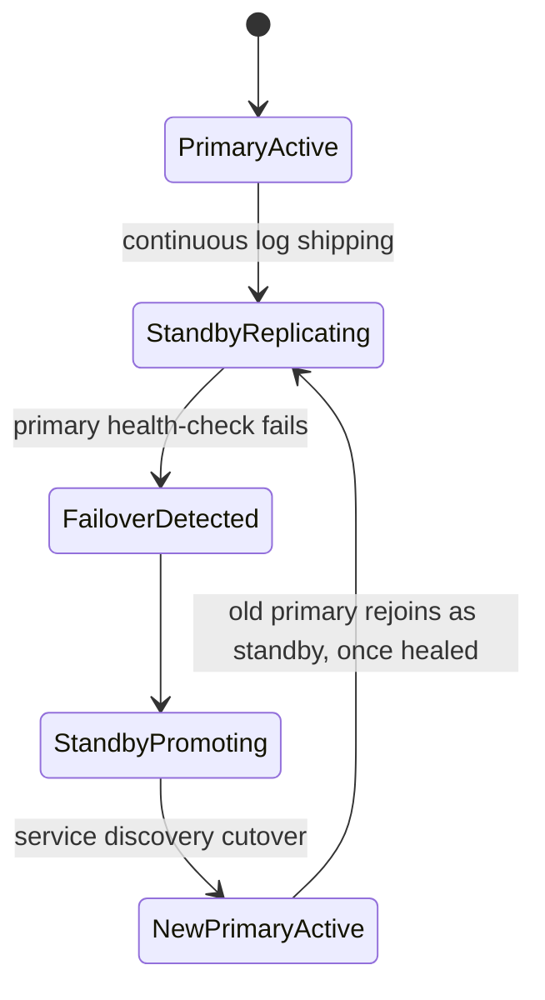
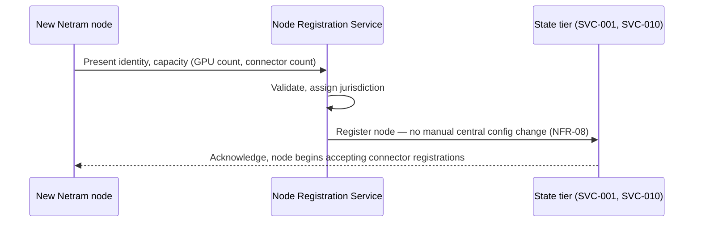
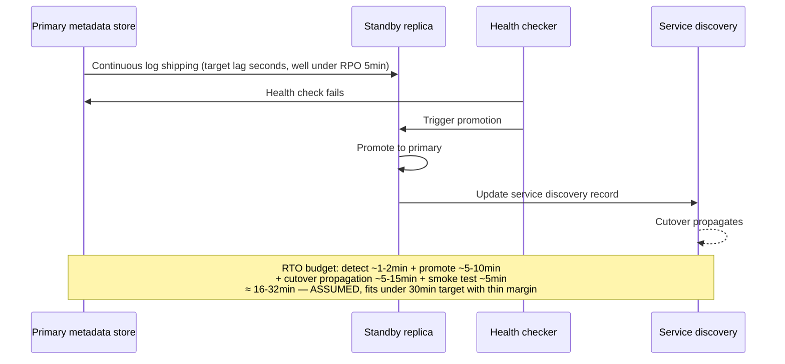

# WS-6 — Scale, Ops & Narrative

**Purpose.** Component-level design for the simulated fleet, load testing,
node registration/scale-out, and disaster recovery. Unlike WS-1..WS-5, this
workstream owns no domain entity of its own — it is the cross-cutting
testing and operations layer over all five (`HLD.md` §1).

**Scope.** Requirement IDs: `NFR-01`–`NFR-08`; [`CAPACITY.md`](../../requirements/CAPACITY.md)
§2–§3; `SCOPE.md` §1. Realises [ADR 0009](../adr/0009-simulated-fleet-architecture.md).
No dedicated container in `HLD.md` §3 owns this workstream exclusively — it
operates the Simulated-Fleet Driver (inside SVC-005) and adds two components
named here for the first time: a Load-Test Harness and a Node Registration
Service (implied by `NFR-08`, not yet placed in any container).

---

## 1. Component decomposition

| Component | Responsibility | Requirement IDs |
|---|---|---|
| Simulated-Fleet Driver | FFmpeg-looped recorded files, real capability declaration (ADR 0009) | build-class discipline |
| Synthetic Registration Script | Registers synthetic cameras via real `REG-08` API, sets the `synthetic` flag (pending [OQ-010](../OPEN-QUESTIONS.md)) | build-class discipline |
| Load-Test Harness | k6/Locust drivers for the metadata path; synthetic event-corpus generator for the query path (`CAPACITY.md` §3) | `NFR-03`, `NFR-04` |
| Node Registration Service | New Netram node joins by registration, no central reconfiguration | `NFR-08` |
| Node Health/Capacity Monitor | Per-node GPU/storage/connector-count visibility for P5 | `NFR-08` (operational) |
| Metadata-Tier DR Controller | Replication + automated failover for the state-tier metadata store | `NFR-06` |

## 2. State machines

**NetramNode lifecycle** (`NFR-08`):

**Metadata-tier DR (state-tier database):**

## 3. Sequence diagrams

### 3.1 New node joins (NFR-08)

### 3.2 Metadata-tier failover (disaster recovery, `NFR-06`)

## 4. Error taxonomy

| Error | Handling |
|---|---|
| Synthetic camera indistinguishable from real in a report | Structural risk named in [OQ-010](../OPEN-QUESTIONS.md) — not yet fixed; this LLD depends on that field existing before load tests are run against production-shaped reports |
| Load test corpus cardinality mismatch | `CAPACITY.md` §3's own named inconsistency (500M-event corpus vs. ~18.7B modelled 90-day volume) — not resolved here, carried forward |
| Node registration with duplicate/conflicting jurisdiction | Rejected; jurisdiction assignment must be unique per node |
| Standby promotion during a genuine network partition (split-brain risk) | **ASSUMED** — needs a fencing mechanism (e.g. a quorum or an external arbiter) so a healed primary doesn't reassert itself as primary after a standby has already been promoted; not designed in detail here, flagged for the DR design's own dedicated review |

## 5. Concurrency model

- Node registration events are independent per node — no cross-node
  coordination required at registration time (this is the literal point of
  `NFR-08`).
- The DR failover path is single-writer by construction (only one primary
  accepts writes at a time) — the risk is exactly the split-brain scenario
  named above, not ordinary concurrency.

## 6. Idempotency keys

| Operation | Key |
|---|---|
| Node registration | (node identity) — re-registering an already-active node updates capacity figures, doesn't duplicate the node |
| Failover promotion | (primary generation number) — a stale primary attempting to reassert with an old generation number is rejected by the fencing mechanism once designed |

## 5.5 The GPU-budget dependency this workstream inherits

`CAPACITY.md` §2.4's ~838-GPU figure and [ADR 0005](../adr/0005-edge-central-split.md)'s
all-edge-inference decision both assume every full-rate/sampled-tier camera
runs *our* inference. [OQ-009](../OPEN-QUESTIONS.md) (open) notes this may be
overstated once VISWAS-bridged cameras (no inference of ours) are subtracted
out. The Node Health/Capacity Monitor's per-node GPU provisioning target is
therefore currently sized against a figure flagged as provisionally
too-high, not a validated one.

## What this does not cover

- The actual resolution of `CAPACITY.md`'s multi-point scaling curve
  (1/100/7,000/17,500/80,000 cameras) — addressed directly in `CAPACITY.md`
  §5 (this session), not duplicated here.
- The split-brain fencing mechanism for DR failover — named as a gap above,
  not designed.
- Real load-test execution and results — this LLD designs the harness;
  running it is implementation/operational work.
